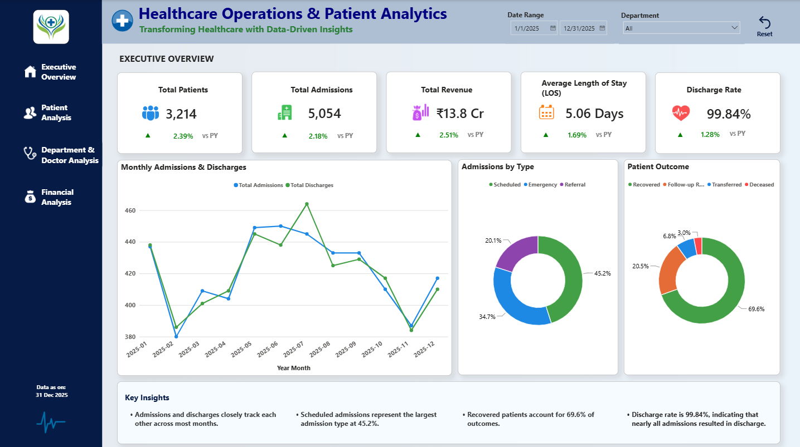
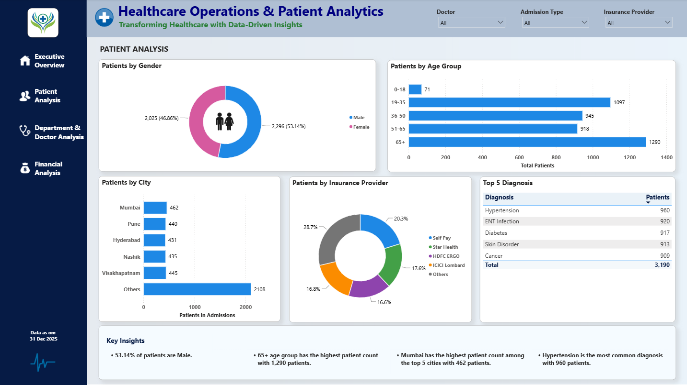
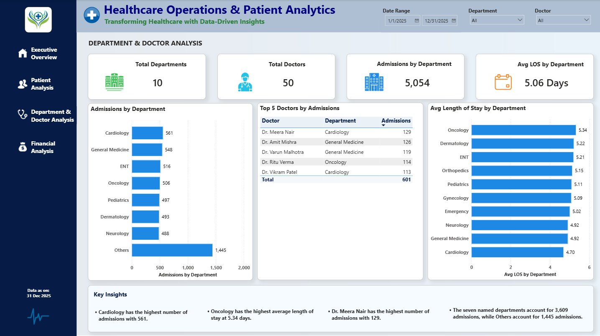
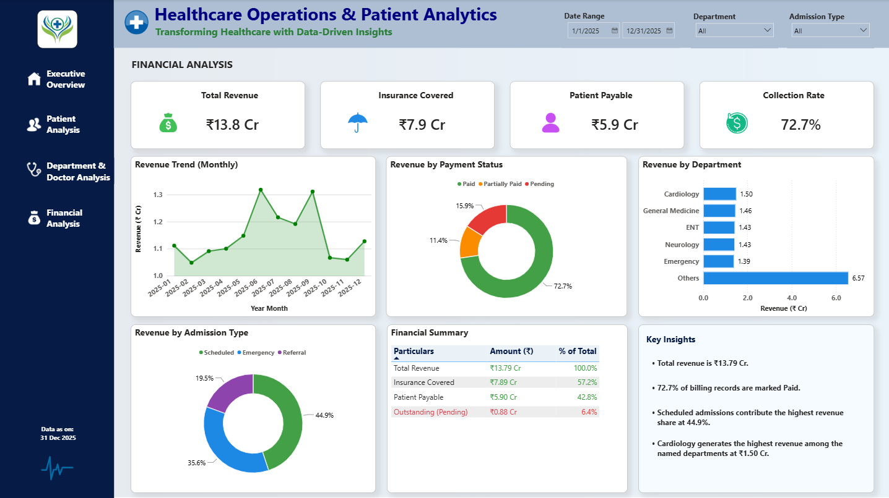

# Healthcare-Operations-Patient-Analytics-PowerBI
Interactive Power BI dashboard for healthcare operations and patient analytics, covering admissions, patients, departments, doctors, treatments, billing, KPIs, and business insights.
## Dashboard Preview

### Executive Overview



### Patient Analysis



### Department & Doctor Analysis



### Financial Analysis




## Project Overview

This project is an interactive healthcare analytics dashboard developed using Microsoft Power BI.

The dashboard analyzes patient demographics, hospital admissions, treatments, doctor performance, department performance, and hospital billing data to generate meaningful KPIs, visual insights, and business findings.


## Dashboard Pages

### 1. Executive Overview

Provides a high-level overview of hospital operations.

**KPIs**
- Total Patients
- Total Admissions
- Total Revenue
- Average Length of Stay
- Discharge Rate

**Visualizations**
- Monthly Admissions & Discharges
- Admissions by Type
- Patient Outcome
- Key Business Insights


### 2. Patient Analysis

Provides analysis of patient demographics and patient-related characteristics.

**Visualizations**
- Patients by Gender
- Patients by Age Group
- Patients by City
- Patients by Insurance Provider
- Top 5 Diagnosis
- Key Business Insights

**Filters**
- Doctor
- Admission Type
- Insurance Provider


### 3. Department & Doctor Analysis

Analyzes hospital departments and doctor-level admission performance.

**KPIs**
- Total Departments
- Total Doctors
- Admissions by Department
- Average Length of Stay

**Visualizations**
- Admissions by Department
- Top 5 Doctors by Admissions
- Average Length of Stay by Department
- Key Business Insights

**Filters**
- Date Range
- Department
- Doctor


### 4. Financial Analysis

Analyzes hospital revenue, insurance coverage, patient payable amounts, and payment status.

**KPIs**
- Total Revenue
- Insurance Covered
- Patient Payable
- Collection Rate

**Visualizations**
- Revenue Trend (Monthly)
- Revenue by Payment Status
- Revenue by Department
- Revenue by Admission Type
- Financial Summary
- Key Business Insights

**Filters**
- Date Range
- Department
- Admission Type

> **Note:** Collection Rate represents the percentage of billing records marked as **Paid**.


## Key Business Insights

### Healthcare Operations

- Total Patients: **3,214**
- Total Admissions: **5,054**
- Average Length of Stay: **5.06 Days**
- Discharge Rate: **99.84%**
- Scheduled admissions represent **45.2%** of admissions.
- Recovered patients account for **69.6%** of outcomes.


### Patient Analysis

- Male patients represent **53.14%** of patients.
- The **65+ age group** has the highest patient count with **1,290 patients**.
- **Hypertension** is the most common diagnosis with **960 patients**.
- Mumbai has the highest patient count among the displayed top cities.


### Department & Doctor Analysis

- **Cardiology** has the highest number of admissions with **561**.
- **Oncology** has the highest average length of stay at **5.34 days**.
- **Dr. Meera Nair** has the highest number of admissions with **129**.
- The seven named departments account for **3,609 admissions**, while Others account for **1,445 admissions**.


### Financial Analysis

- Total Revenue: **₹13.79 Cr**
- Insurance Covered: **₹7.89 Cr**
- Patient Payable: **₹5.90 Cr**
- **72.7%** of billing records are marked Paid.
- Scheduled admissions contribute **44.9%** of revenue.
- Cardiology generates the highest revenue among the named departments at approximately **₹1.50 Cr**.


## Data Model

The dashboard uses the following tables:

- Patients
- Admissions
- Doctors
- Departments
- Treatments
- Billing
- DateTable

### Main Relationships

```text
Patients       1 ─────── * Admissions
Doctors        1 ─────── * Admissions
Departments    1 ─────── * Admissions
Departments    1 ─────── * Doctors
Admissions     1 ─────── * Treatments
Admissions     1 ─────── 1 Billing

DateTable      1 ─────── * Admissions
